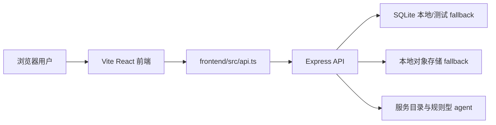

# 技术架构

本文档按当前代码实现同步，描述酷里官网与订单系统的前后端技术栈、运行结构、数据边界和已知限制。

## 总览



当前系统是一个 npm workspace，根目录统一调度 `backend` 和 `frontend`。前端通过 `VITE_API_BASE_URL` 调用后端 JSON API；后端负责登录鉴权、角色权限、服务目录、订单、消息、附件 metadata、报价、付款记录和交付物。

## 技术栈

| 层 | 技术 | 当前用途 |
| --- | --- | --- |
| 前端 | React 19 | 页面组件、状态渲染、交互界面 |
| 前端 | Vite 6 | 本地开发服务器与前端构建 |
| 前端 | TypeScript 5 | 类型检查与前端类型建模 |
| 前端 | React Router DOM 7 | 首页、服务详情、写小纸条、登录、订单、后台等路由 |
| 前端 | lucide-react | 图标 |
| 后端 | Node.js + Express 4 | HTTP API、路由、中间件、错误处理 |
| 后端 | TypeScript ESM | 后端源码与构建输出 |
| 后端 | Zod | 请求体校验 |
| 后端 | cors | CORS 配置 |
| 后端 | better-sqlite3 | 当前 SQLite 本地/测试数据存储 |
| 安全 | PBKDF2 + HMAC token | 密码哈希和自签名 token |
| 测试 | Vitest + Supertest | 后端 API 与权限测试 |
| 工程 | npm workspaces + concurrently | 前后端依赖与本地并行启动 |

## 前端架构

主要文件：

- `frontend/src/App.tsx`：集中定义页面路由和主要页面，包括首页、服务页、服务详情页、写小纸条、登录注册、用户订单工作台、管理员后台和预留项目页。
- `frontend/src/api.ts`：封装所有后端 API 请求，统一处理 `VITE_API_BASE_URL`、JSON 请求头、Bearer token 和错误响应。
- `frontend/src/auth.tsx`：维护登录态，将 token 存入 `localStorage`，启动时通过 `/api/auth/me` 恢复用户信息。
- `frontend/src/types.ts`：定义用户、服务目录、订单、事件、消息、附件、报价、付款、交付物和 agent brief 类型。
- `frontend/src/data.ts`：前端状态文案、图标和展示辅助数据。
- `frontend/src/styles.css`：全局视觉样式和响应式布局。

当前路由：

| 路由 | 页面 |
| --- | --- |
| `/` | 官网首页 |
| `/services` | 服务列表 |
| `/services/:slug` | 服务详情 |
| `/how-it-works` | 服务流程 |
| `/rules` | 交易规则 |
| `/note` | 写小纸条 |
| `/login` | 登录/注册 |
| `/orders` | 普通账号订单工作台，需要登录 |
| `/admin` | 管理员订单后台，需要管理员角色 |
| `/projects` | 子产品/项目页占位 |

## 后端架构

主要文件：

- `backend/src/server.ts`：读取 `PORT` 并启动 Express app。
- `backend/src/app.ts`：创建 API app，配置 CORS、JSON body、路由、鉴权、管理员 guard、错误处理和 DTO 输出。
- `backend/src/database.ts`：负责 SQLite 连接、schema migration、seed 数据、订单和关联集合的数据访问。
- `backend/src/catalog.ts`：维护服务分类和详情内容，当前服务内容由代码维护。
- `backend/src/agent.ts`：提供规则型需求润色和管理员 agent brief，不调用外部 LLM。
- `backend/src/security.ts`：提供 PBKDF2 密码哈希、密码校验、HMAC token 签发和校验。
- `backend/src/app.test.ts`：覆盖登录、权限隔离、公开小纸条、订单创建和管理员更新等行为。

后端运行时从环境变量读取：

- `PORT`：API 端口，默认 `4000`。
- `CORS_ORIGIN`：允许访问 API 的前端来源，默认允许值来自环境配置。
- `JWT_SECRET`：token 签名密钥，未配置时使用仅适合本地开发的默认值。
- `DATABASE_PATH`：SQLite 数据库路径，默认 `backend/data/kuli.sqlite`。
- `LOCAL_OBJECT_STORE_DIR`：本地附件对象存储目录，默认 `backend/data/object-store`。

## API 边界

当前 API 按以下领域组织：

- 健康检查：`GET /health`
- 服务目录：`GET /api/services`、`GET /api/services/:slug`
- 需求润色：`POST /api/ai/polish-demand`
- 登录注册：`POST /api/auth/login`、`POST /api/auth/register`、`GET /api/auth/me`
- 游客小纸条：`POST /api/public/inquiries`
- 普通账号订单：`GET /api/orders`、`POST /api/orders`、`GET /api/orders/:orderNumber`
- 普通账号协作：`POST /api/orders/:orderNumber/messages`、`POST /api/orders/:orderNumber/attachments`、`POST /api/orders/:orderNumber/acceptance`
- 管理员订单：`GET /api/admin/orders`、`GET /api/admin/orders/:orderNumber`、`PATCH /api/admin/orders/:orderNumber`
- 管理员业务动作：`POST /api/admin/orders/:orderNumber/quotes`、`POST /api/admin/orders/:orderNumber/payments`、`POST /api/admin/orders/:orderNumber/deliverables`、`PATCH /api/admin/orders/:orderNumber/status`

权限边界：

- 未登录用户只能查看公开服务内容并提交游客小纸条。
- 普通账号只能通过 `owner_user_id` 访问自己的订单。
- 管理员角色可以访问全部订单，并看到成本、利润、内部备注和 agent brief。
- 客户响应会过滤内部字段；管理员响应包含内部字段。

## 数据模型

当前 SQLite schema 在 `backend/src/database.ts` 中创建，核心表包括：

- `users`：用户账号、密码哈希、角色和展示名。
- `service_categories`：服务分类和详情 JSON。
- `orders`：订单主表，包含归属用户、服务类型、需求、状态、报价、成本、利润、备注和时间戳。
- `order_events`：订单状态时间线。
- `order_messages`：订单沟通记录。
- `order_attachments`：附件 metadata 和 storage key。
- `quotes`：报价记录。
- `payment_records`：人工收款记录。
- `deliverables`：交付物记录。
- `admin_audit_logs`：管理员审计日志表已建表，当前业务路由还未写入审计记录。

本地 seed 会创建管理员和两个普通账号，并写入服务目录与示例订单，便于验证权限隔离。

## 存储策略

当前实现：

- 数据库存储使用 SQLite，适合本地开发、测试和早期演示。
- 附件上传接口接收 JSON body，可以带 `contentBase64` 或传入已有 `storageKey`。
- 真实文件内容在本地 fallback 中写入 `LOCAL_OBJECT_STORE_DIR`。
- 数据库只保存附件 metadata、上传者、可见性、文件大小、类型和 storage key。

正式发布目标：

- `backend/.env.example` 已预留 `DATABASE_URL` 和 `OBJECT_STORAGE_*` 配置。
- 当前代码尚未实现 Postgres adapter 或 S3/R2/OSS adapter。
- 上线前需要补齐数据库迁移策略、对象存储签名访问、附件下载鉴权和备份策略。

## 安全与权限

- 密码使用 PBKDF2 哈希保存，不明文入库。
- 登录后端签发 HMAC token，前端以 Bearer token 调用受保护 API。
- 管理后台路由需要 `role === "admin"`。
- 普通账号订单查询使用用户 ID 与订单号共同过滤，避免跨账号访问。
- 生产环境必须替换 `JWT_SECRET`，并避免使用示例账号和本地 SQLite 数据。

## 当前限制

- AI 能力是本地规则型 helper，还不是外部 LLM、RAG 或可持续学习的“小酷”agent。
- 管理员订单列表当前由后端返回全量列表，搜索和筛选主要适合早期数据量。
- 在线支付网关未接入，付款记录只支持管理员人工登记。
- 附件上传不是 multipart 流式上传，大文件和下载权限链路还需要生产化设计。
- `admin_audit_logs` 表已存在，但当前管理员操作还没有写入审计日志。
- 前端主要页面集中在 `App.tsx`，后续 2.0 迭代应拆分页面、组件和 hooks，降低维护成本。

## 验证命令

```bash
npm run typecheck
npm run test
npm run build
openspec validate add-kuli-order-portal --strict
```

日常开发可先跑 `npm run typecheck` 和 `npm run test`；发布前再跑完整构建与 OpenSpec 校验。
